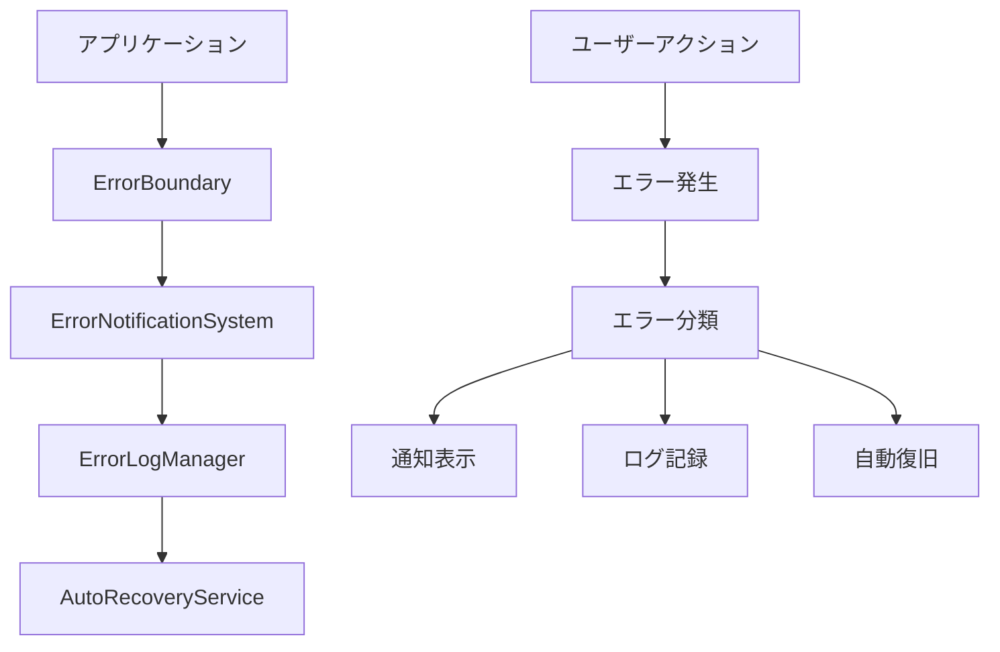

# エラーハンドリング機能 技術仕様書

**バージョン**: 1.0.0  
**最終更新**: 2025年6月26日  
**対象**: 開発者・エンジニア

---

## 目次

1. [概要](#1-概要)
2. [アーキテクチャ](#2-アーキテクチャ)
3. [実装詳細](#3-実装詳細)
4. [API仕様](#4-api仕様)
5. [設定・カスタマイズ](#5-設定カスタマイズ)
6. [テスト仕様](#6-テスト仕様)
7. [デプロイメント](#7-デプロイメント)

---

## 1. 概要

### 1.1 目的

TasQ Flowにおける包括的なエラーハンドリングシステムの実装により、ユーザー体験の向上と開発効率の改善を図る。

### 1.2 機能要件

- **エラーバウンダリ**: Reactコンポーネントレベルでのエラーキャッチ
- **エラー通知システム**: ユーザーフレンドリーな通知表示
- **エラーログ管理**: 包括的なエラー追跡と分析
- **自動エラー回復**: システムの自動復旧機能

### 1.3 技術要件

- React 18以降
- TypeScript 5以降
- Material-UI v5以降
- 状態管理: Zustand推奨

---

## 2. アーキテクチャ

### 2.1 システム構成



### 2.2 コンポーネント階層

```
App
├── ErrorBoundary (最上位)
│   ├── Header
│   ├── Sidebar
│   ├── MainContent
│   │   ├── ErrorBoundary (機能別)
│   │   └── FeatureComponents
│   └── ErrorNotificationSystem
└── ErrorLogManager
```

---

## 3. 実装詳細

### 3.1 ErrorBoundary実装

```typescript
// src/components/ErrorHandling/ErrorBoundary.tsx

import React, { Component, ReactNode, ErrorInfo } from 'react';
import { Box, Paper, Typography, Button, Collapse, Alert } from '@mui/material';
import { 
  ErrorOutline as ErrorIcon, 
  Home as HomeIcon,
  Refresh as RefreshIcon,
  ExpandMore as ExpandIcon 
} from '@mui/icons-material';

interface Props {
  children: ReactNode;
  fallback?: ReactNode;
  onError?: (error: Error, errorInfo: ErrorInfo) => void;
  level?: 'app' | 'feature' | 'component';
}

interface State {
  hasError: boolean;
  error?: Error;
  errorInfo?: ErrorInfo;
  showDetails: boolean;
  retryCount: number;
}

export class ErrorBoundary extends Component<Props, State> {
  private maxRetries = 3;
  
  constructor(props: Props) {
    super(props);
    this.state = {
      hasError: false,
      showDetails: false,
      retryCount: 0,
    };
  }

  static getDerivedStateFromError(error: Error): Partial<State> {
    return { hasError: true, error };
  }

  componentDidCatch(error: Error, errorInfo: ErrorInfo) {
    console.error('🚨 ErrorBoundary caught error:', error, errorInfo);
    
    // エラー情報をローカルストレージに保存
    this.saveErrorToStorage(error, errorInfo);
    
    // 親コンポーネントのエラーハンドラを呼び出し
    this.props.onError?.(error, errorInfo);
    
    this.setState({ 
      error, 
      errorInfo,
      retryCount: this.state.retryCount + 1 
    });
  }

  private saveErrorToStorage(error: Error, errorInfo: ErrorInfo) {
    try {
      const errorLog = {
        timestamp: new Date().toISOString(),
        message: error.message,
        stack: error.stack,
        componentStack: errorInfo.componentStack,
        level: this.props.level || 'unknown',
        url: window.location.href,
        userAgent: navigator.userAgent,
      };

      const existingLogs = JSON.parse(
        localStorage.getItem('tasq_error_logs') || '[]'
      );
      
      // 最新10件まで保持
      const updatedLogs = [errorLog, ...existingLogs].slice(0, 10);
      localStorage.setItem('tasq_error_logs', JSON.stringify(updatedLogs));
    } catch (storageError) {
      console.error('Failed to save error to storage:', storageError);
    }
  }

  private handleRetry = () => {
    if (this.state.retryCount < this.maxRetries) {
      this.setState({ 
        hasError: false, 
        error: undefined, 
        errorInfo: undefined 
      });
    }
  };

  private handleGoHome = () => {
    window.location.href = '/';
  };

  private toggleDetails = () => {
    this.setState({ showDetails: !this.state.showDetails });
  };

  render() {
    if (this.state.hasError) {
      // カスタムフォールバックUIが提供されている場合
      if (this.props.fallback) {
        return this.props.fallback;
      }

      const { error, errorInfo, showDetails, retryCount } = this.state;
      const canRetry = retryCount < this.maxRetries;

      return (
        <Box
          sx={{
            display: 'flex',
            flexDirection: 'column',
            alignItems: 'center',
            justifyContent: 'center',
            minHeight: '50vh',
            p: 3,
            textAlign: 'center',
          }}
        >
          <Paper
            elevation={3}
            sx={{
              p: 4,
              maxWidth: 600,
              width: '100%',
              background: 'linear-gradient(135deg, #fff5f5 0%, #fed7d7 100%)',
              border: '1px solid rgba(254, 215, 215, 0.5)',
            }}
          >
            <ErrorIcon 
              sx={{ 
                fontSize: 64, 
                color: 'error.main', 
                mb: 2,
                animation: 'pulse 2s infinite',
                '@keyframes pulse': {
                  '0%': { opacity: 1 },
                  '50%': { opacity: 0.5 },
                  '100%': { opacity: 1 },
                },
              }} 
            />
            
            <Typography variant="h4" color="error.main" gutterBottom>
              申し訳ございません
            </Typography>
            
            <Typography variant="body1" color="text.secondary" paragraph>
              予期しないエラーが発生しました。ご迷惑をおかけして申し訳ございません。
            </Typography>

            {error && (
              <Alert severity="error" sx={{ mb: 2, textAlign: 'left' }}>
                <Typography variant="body2" sx={{ fontFamily: 'monospace' }}>
                  {error.message}
                </Typography>
              </Alert>
            )}

            <Box sx={{ display: 'flex', gap: 2, justifyContent: 'center', mb: 2 }}>
              {canRetry && (
                <Button
                  variant="contained"
                  startIcon={<RefreshIcon />}
                  onClick={this.handleRetry}
                  color="primary"
                >
                  再試行 ({this.maxRetries - retryCount}回残り)
                </Button>
              )}
              
              <Button
                variant="outlined"
                startIcon={<HomeIcon />}
                onClick={this.handleGoHome}
              >
                ホームに戻る
              </Button>
            </Box>

            <Button
              size="small"
              startIcon={<ExpandIcon />}
              onClick={this.toggleDetails}
              sx={{ 
                color: 'text.secondary',
                transform: showDetails ? 'rotate(180deg)' : 'none',
                transition: 'transform 0.3s ease',
              }}
            >
              詳細情報
            </Button>

            <Collapse in={showDetails}>
              <Paper
                variant="outlined"
                sx={{
                  mt: 2,
                  p: 2,
                  backgroundColor: 'rgba(0, 0, 0, 0.02)',
                  maxHeight: 200,
                  overflow: 'auto',
                }}
              >
                <Typography
                  variant="caption"
                  component="pre"
                  sx={{
                    fontFamily: 'monospace',
                    fontSize: '0.75rem',
                    whiteSpace: 'pre-wrap',
                    wordBreak: 'break-word',
                  }}
                >
                  {error?.stack}
                  {errorInfo?.componentStack}
                </Typography>
              </Paper>
            </Collapse>
          </Paper>
        </Box>
      );
    }

    return this.props.children;
  }
}
```

### 3.2 ErrorNotificationSystem実装

```typescript
// src/components/ErrorHandling/ErrorNotificationSystem.tsx

import React from 'react';
import { 
  Snackbar, 
  Alert, 
  AlertTitle, 
  Button, 
  Box,
  Typography,
  Chip 
} from '@mui/material';
import { useErrorNotificationStore } from '../../stores/errorNotificationStore';

interface ErrorNotification {
  id: string;
  type: 'network' | 'validation' | 'permission' | 'data' | 'performance';
  message: string;
  details?: string;
  timestamp: Date;
  retryable: boolean;
  onRetry?: () => void;
}

interface Props {
  maxNotifications?: number;
  position?: {
    vertical: 'top' | 'bottom';
    horizontal: 'left' | 'center' | 'right';
  };
  onRetry?: (error: ErrorNotification) => void;
}

export const ErrorNotificationSystem: React.FC<Props> = ({
  maxNotifications = 3,
  position = { vertical: 'top', horizontal: 'right' },
  onRetry,
}) => {
  const { 
    notifications, 
    removeNotification, 
    clearAll,
    getErrorStats 
  } = useErrorNotificationStore();

  const getSeverity = (type: ErrorNotification['type']) => {
    switch (type) {
      case 'network': return 'warning';
      case 'validation': return 'error';
      case 'permission': return 'error';
      case 'data': return 'error';
      case 'performance': return 'info';
      default: return 'error';
    }
  };

  const getTypeLabel = (type: ErrorNotification['type']) => {
    switch (type) {
      case 'network': return 'ネットワーク';
      case 'validation': return 'バリデーション';
      case 'permission': return '権限';
      case 'data': return 'データ';
      case 'performance': return 'パフォーマンス';
      default: return 'システム';
    }
  };

  const handleRetry = (notification: ErrorNotification) => {
    if (notification.onRetry) {
      notification.onRetry();
    } else if (onRetry) {
      onRetry(notification);
    }
    removeNotification(notification.id);
  };

  const displayedNotifications = notifications.slice(0, maxNotifications);
  const stats = getErrorStats();

  return (
    <>
      {displayedNotifications.map((notification, index) => (
        <Snackbar
          key={notification.id}
          open={true}
          anchorOrigin={position}
          sx={{
            position: 'fixed',
            top: position.vertical === 'top' 
              ? `${80 + index * 80}px` 
              : undefined,
            bottom: position.vertical === 'bottom' 
              ? `${20 + index * 80}px` 
              : undefined,
            zIndex: 9999 - index,
          }}
        >
          <Alert
            severity={getSeverity(notification.type) as any}
            onClose={() => removeNotification(notification.id)}
            sx={{
              minWidth: 400,
              backgroundColor: 'rgba(255, 255, 255, 0.95)',
              backdropFilter: 'blur(10px)',
              border: '1px solid rgba(0, 0, 0, 0.1)',
              boxShadow: '0 8px 32px rgba(0, 0, 0, 0.1)',
            }}
            action={
              <Box sx={{ display: 'flex', gap: 1, alignItems: 'center' }}>
                {notification.retryable && (
                  <Button
                    size="small"
                    variant="outlined"
                    onClick={() => handleRetry(notification)}
                  >
                    再試行
                  </Button>
                )}
                <Chip
                  label={getTypeLabel(notification.type)}
                  size="small"
                  variant="outlined"
                  sx={{ fontSize: '0.7rem' }}
                />
              </Box>
            }
          >
            <AlertTitle>{notification.message}</AlertTitle>
            {notification.details && (
              <Typography variant="body2" sx={{ mt: 1 }}>
                {notification.details}
              </Typography>
            )}
            <Typography variant="caption" sx={{ mt: 1, display: 'block' }}>
              {notification.timestamp.toLocaleTimeString()}
            </Typography>
          </Alert>
        </Snackbar>
      ))}

      {/* エラー統計表示（開発者向け） */}
      {process.env.NODE_ENV === 'development' && stats.total > 0 && (
        <Box
          sx={{
            position: 'fixed',
            bottom: 20,
            left: 20,
            p: 2,
            backgroundColor: 'rgba(0, 0, 0, 0.8)',
            color: 'white',
            borderRadius: 2,
            fontSize: '0.75rem',
            zIndex: 10000,
          }}
        >
          <Typography variant="caption" display="block">
            過去24時間のエラー: {stats.total}件
          </Typography>
          <Button
            size="small"
            onClick={clearAll}
            sx={{ color: 'white', mt: 1 }}
          >
            クリア
          </Button>
        </Box>
      )}
    </>
  );
};
```

### 3.3 エラーストア実装

```typescript
// src/stores/errorNotificationStore.ts

import { create } from 'zustand';

interface ErrorNotification {
  id: string;
  type: 'network' | 'validation' | 'permission' | 'data' | 'performance';
  message: string;
  details?: string;
  timestamp: Date;
  retryable: boolean;
  onRetry?: () => void;
}

interface ErrorStats {
  total: number;
  byType: Record<string, number>;
  last24Hours: ErrorNotification[];
}

interface ErrorNotificationStore {
  notifications: ErrorNotification[];
  addNotification: (notification: Omit<ErrorNotification, 'id' | 'timestamp'>) => void;
  removeNotification: (id: string) => void;
  clearAll: () => void;
  getErrorStats: () => ErrorStats;
}

export const useErrorNotificationStore = create<ErrorNotificationStore>((set, get) => ({
  notifications: [],

  addNotification: (notification) => {
    const newNotification: ErrorNotification = {
      ...notification,
      id: `error_${Date.now()}_${Math.random().toString(36).substr(2, 9)}`,
      timestamp: new Date(),
    };

    set((state) => ({
      notifications: [newNotification, ...state.notifications],
    }));

    // 自動削除（5秒後）
    setTimeout(() => {
      get().removeNotification(newNotification.id);
    }, 5000);
  },

  removeNotification: (id) => {
    set((state) => ({
      notifications: state.notifications.filter(n => n.id !== id),
    }));
  },

  clearAll: () => {
    set({ notifications: [] });
  },

  getErrorStats: () => {
    const notifications = get().notifications;
    const now = new Date();
    const twentyFourHoursAgo = new Date(now.getTime() - 24 * 60 * 60 * 1000);
    
    const last24Hours = notifications.filter(
      n => n.timestamp >= twentyFourHoursAgo
    );

    const byType = last24Hours.reduce((acc, notification) => {
      acc[notification.type] = (acc[notification.type] || 0) + 1;
      return acc;
    }, {} as Record<string, number>);

    return {
      total: last24Hours.length,
      byType,
      last24Hours,
    };
  },
}));
```

---

## 4. API仕様

### 4.1 エラーレポート送信

```typescript
// src/utils/errorReporting.ts

interface ErrorReport {
  timestamp: string;
  level: 'error' | 'warning' | 'info';
  message: string;
  stack?: string;
  componentStack?: string;
  url: string;
  userAgent: string;
  userId?: string;
  sessionId: string;
  buildVersion: string;
}

export const sendErrorReport = async (report: ErrorReport): Promise<void> => {
  try {
    const response = await fetch('/api/errors', {
      method: 'POST',
      headers: {
        'Content-Type': 'application/json',
      },
      body: JSON.stringify(report),
    });

    if (!response.ok) {
      throw new Error(`Failed to send error report: ${response.status}`);
    }
  } catch (error) {
    console.error('Failed to send error report:', error);
    // エラーレポート送信失敗時はローカルストレージに保存
    const failedReports = JSON.parse(
      localStorage.getItem('failed_error_reports') || '[]'
    );
    failedReports.push(report);
    localStorage.setItem('failed_error_reports', JSON.stringify(failedReports));
  }
};
```

---

## 5. 設定・カスタマイズ

### 5.1 設定ファイル

```typescript
// src/config/errorHandling.ts

export const ERROR_HANDLING_CONFIG = {
  // ErrorBoundary設定
  errorBoundary: {
    maxRetries: 3,
    logToConsole: true,
    logToStorage: true,
    sendToServer: process.env.NODE_ENV === 'production',
  },

  // 通知システム設定
  notifications: {
    maxVisible: 3,
    autoHideDelay: 5000,
    position: {
      vertical: 'top' as const,
      horizontal: 'right' as const,
    },
  },

  // ログ設定
  logging: {
    maxLocalStorageEntries: 10,
    retentionDays: 7,
    enableDebugMode: process.env.NODE_ENV === 'development',
  },

  // 自動復旧設定
  autoRecovery: {
    enableNetworkRetry: true,
    maxNetworkRetries: 3,
    retryDelay: 1000,
    exponentialBackoff: true,
  },
} as const;
```

### 5.2 カスタムフック

```typescript
// src/hooks/useErrorHandler.ts

import { useCallback } from 'react';
import { useErrorNotificationStore } from '../stores/errorNotificationStore';

interface UseErrorHandlerReturn {
  handleError: (error: Error, context?: string) => void;
  handleNetworkError: (error: Error, retry?: () => void) => void;
  handleValidationError: (message: string, details?: string) => void;
}

export const useErrorHandler = (): UseErrorHandlerReturn => {
  const { addNotification } = useErrorNotificationStore();

  const handleError = useCallback((error: Error, context?: string) => {
    console.error(`Error in ${context}:`, error);
    
    addNotification({
      type: 'data',
      message: 'エラーが発生しました',
      details: error.message,
      retryable: false,
    });
  }, [addNotification]);

  const handleNetworkError = useCallback((error: Error, retry?: () => void) => {
    console.error('Network error:', error);
    
    addNotification({
      type: 'network',
      message: 'ネットワークエラーが発生しました',
      details: '接続を確認してください',
      retryable: !!retry,
      onRetry: retry,
    });
  }, [addNotification]);

  const handleValidationError = useCallback((message: string, details?: string) => {
    addNotification({
      type: 'validation',
      message,
      details,
      retryable: false,
    });
  }, [addNotification]);

  return {
    handleError,
    handleNetworkError,
    handleValidationError,
  };
};
```

---

## 6. テスト仕様

### 6.1 ErrorBoundaryテスト

```typescript
// src/components/ErrorHandling/__tests__/ErrorBoundary.test.tsx

import React from 'react';
import { render, screen, fireEvent } from '@testing-library/react';
import { ErrorBoundary } from '../ErrorBoundary';

const ThrowError = ({ shouldThrow }: { shouldThrow: boolean }) => {
  if (shouldThrow) {
    throw new Error('Test error');
  }
  return <div>No error</div>;
};

describe('ErrorBoundary', () => {
  beforeEach(() => {
    jest.spyOn(console, 'error').mockImplementation(() => {});
  });

  afterEach(() => {
    (console.error as jest.Mock).mockRestore();
  });

  it('should render children when there is no error', () => {
    render(
      <ErrorBoundary>
        <ThrowError shouldThrow={false} />
      </ErrorBoundary>
    );

    expect(screen.getByText('No error')).toBeInTheDocument();
  });

  it('should render error UI when error occurs', () => {
    render(
      <ErrorBoundary>
        <ThrowError shouldThrow={true} />
      </ErrorBoundary>
    );

    expect(screen.getByText('申し訳ございません')).toBeInTheDocument();
    expect(screen.getByText('再試行')).toBeInTheDocument();
  });

  it('should allow retry when retry count is below max', () => {
    const { rerender } = render(
      <ErrorBoundary>
        <ThrowError shouldThrow={true} />
      </ErrorBoundary>
    );

    fireEvent.click(screen.getByText('再試行'));

    rerender(
      <ErrorBoundary>
        <ThrowError shouldThrow={false} />
      </ErrorBoundary>
    );

    expect(screen.getByText('No error')).toBeInTheDocument();
  });
});
```

---

## 7. デプロイメント

### 7.1 環境設定

```bash
# 本番環境
REACT_APP_ERROR_REPORTING_ENDPOINT=https://api.tasqflow.com/errors
REACT_APP_ENABLE_ERROR_REPORTING=true
REACT_APP_LOG_LEVEL=error

# 開発環境
REACT_APP_ERROR_REPORTING_ENDPOINT=http://localhost:3001/errors
REACT_APP_ENABLE_ERROR_REPORTING=false
REACT_APP_LOG_LEVEL=debug
```

### 7.2 使用方法

```typescript
// App.tsx での使用例
import { ErrorBoundary } from './components/ErrorHandling/ErrorBoundary';
import { ErrorNotificationSystem } from './components/ErrorHandling/ErrorNotificationSystem';

function App() {
  return (
    <ErrorBoundary
      onError={(error, errorInfo) => {
        console.error('Application error:', error, errorInfo);
      }}
    >
      <YourApplicationComponents />
      <ErrorNotificationSystem
        maxNotifications={3}
        position={{ vertical: 'top', horizontal: 'right' }}
        onRetry={(error) => {
          console.log('Retrying after error:', error);
        }}
      />
    </ErrorBoundary>
  );
}
```

---

## 改訂履歴

| バージョン | 日付 | 変更内容 | 担当者 |
|-----------|------|----------|--------|
| 1.0.0 | 2025-06-26 | 初版作成 | Claude |

---

**注意**: この技術仕様書は開発者向けの詳細な実装ガイドです。実際の実装時は、プロジェクトの要件に応じて適切にカスタマイズしてください。